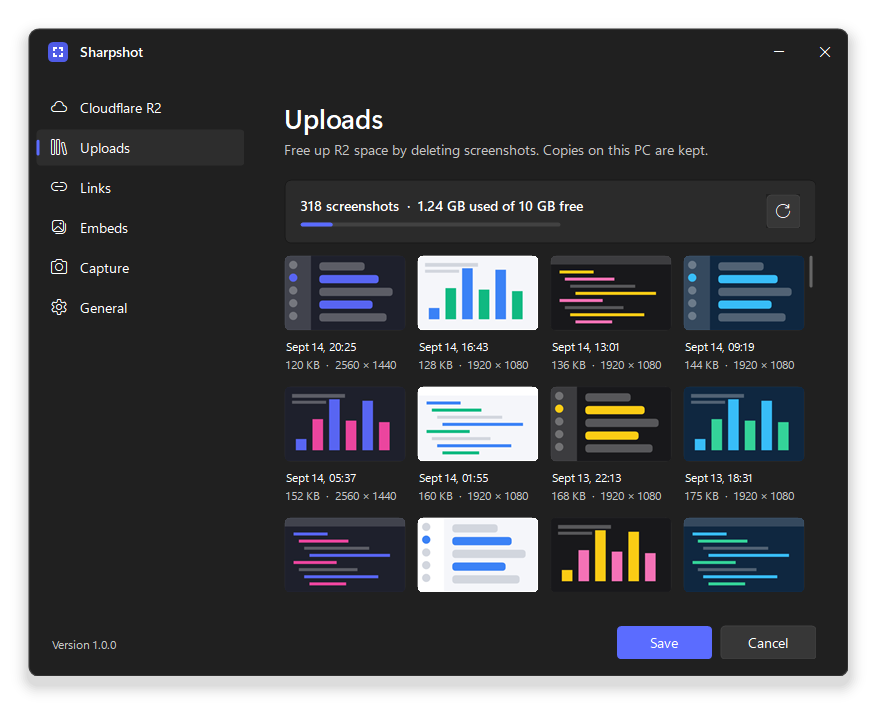
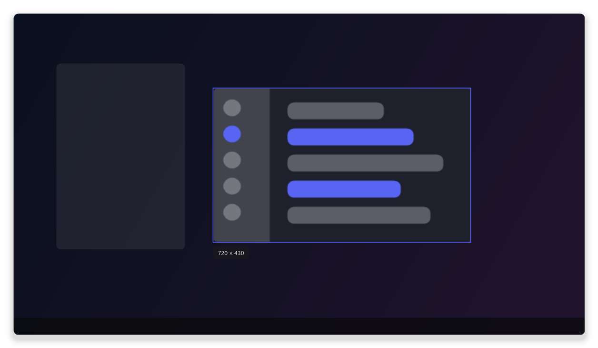
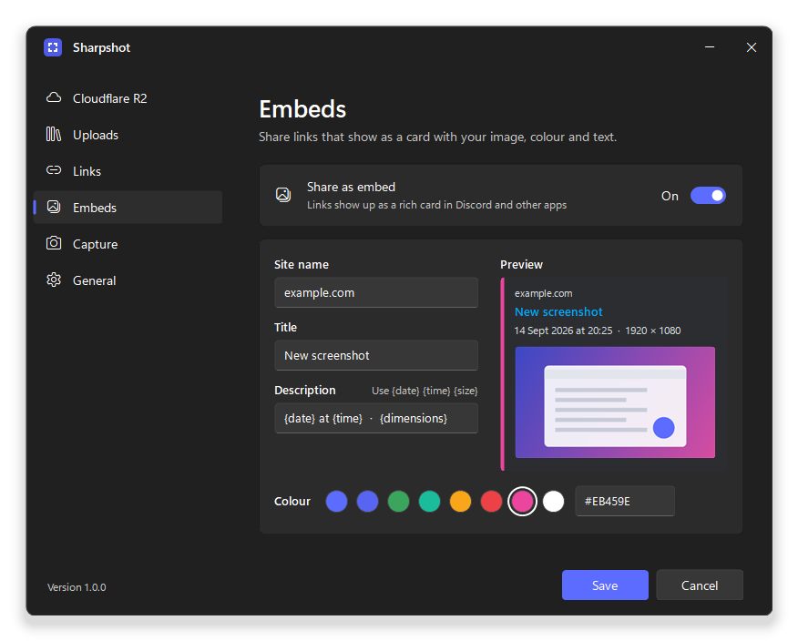
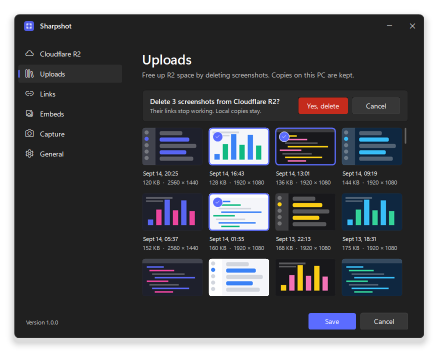
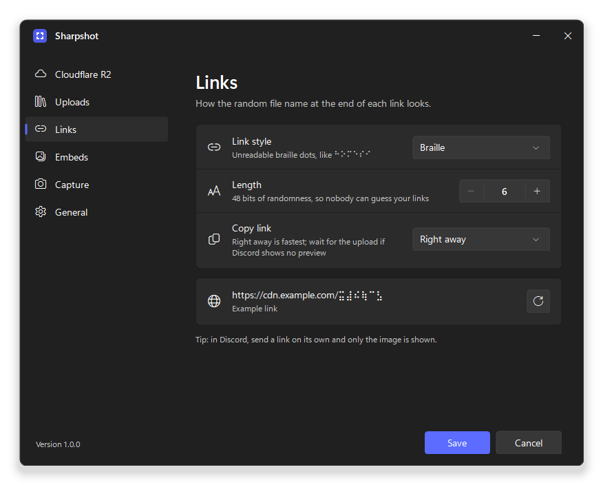
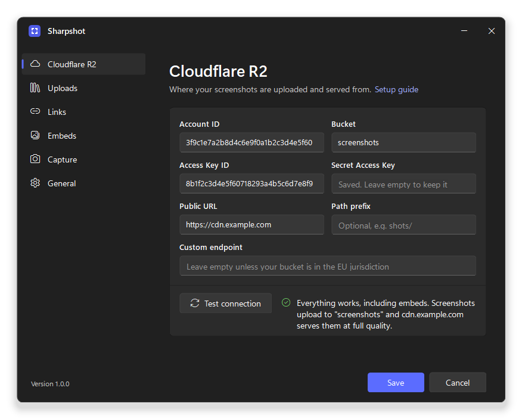
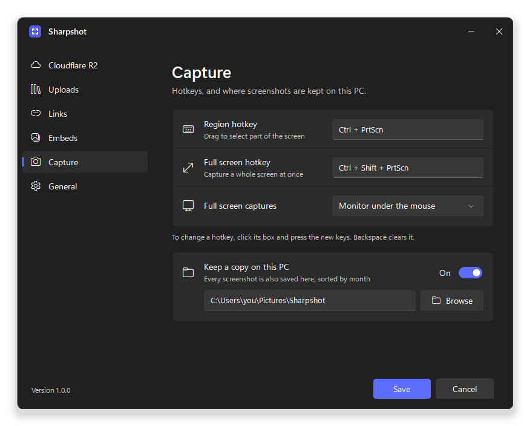
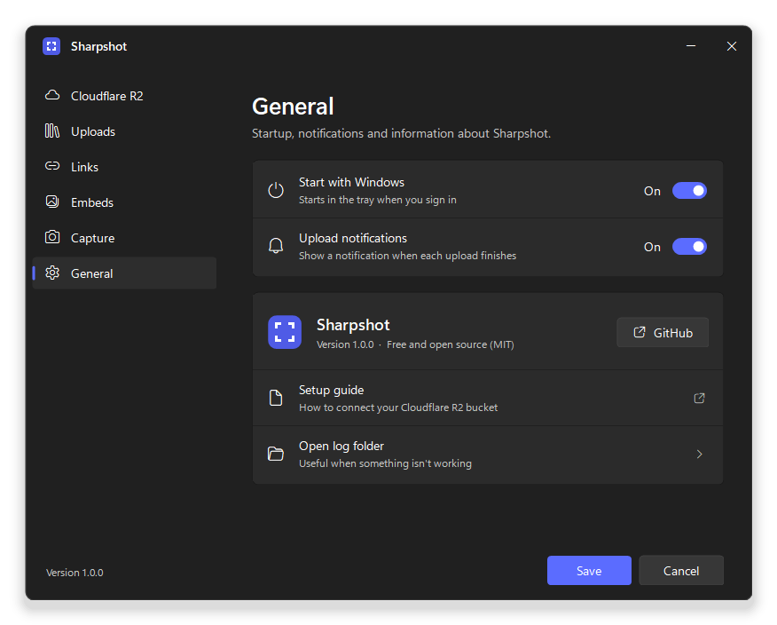
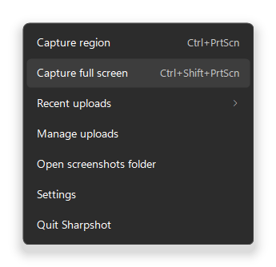
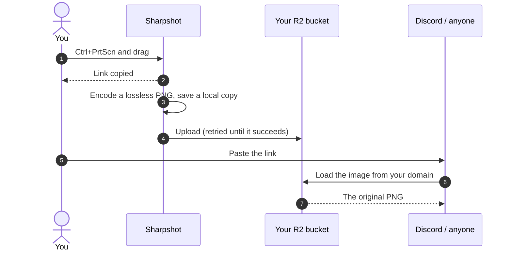

<div align="center">
  

  <h1>Sharpshot</h1>

  <p>
    <b>Take a screenshot, get a link.</b><br>
    A small Windows tray app that uploads lossless screenshots to your own Cloudflare R2 bucket.
  </p>

  <p>
    <a href="https://github.com/Ubaidullah71/sharpshot/releases/latest"></a>
    <a href="https://github.com/Ubaidullah71/sharpshot/actions/workflows/ci.yml"></a>
    <a href="LICENSE"></a>
  </p>

  <p>
    <a href="https://github.com/Ubaidullah71/sharpshot/releases/latest"><b>Download</b></a>
    &nbsp;·&nbsp;
    <a href="#quick-start">Quick start</a>
    &nbsp;·&nbsp;
    <a href="#set-up-cloudflare-r2">R2 setup</a>
    &nbsp;·&nbsp;
    <a href="#faq">FAQ</a>
    &nbsp;·&nbsp;
    <a href="https://github.com/Ubaidullah71/sharpshot/issues">Issues</a>
  </p>

  <br>

  
</div>

<br>

Discord and most chat apps recompress screenshots, which blurs text. Sharpshot uploads the original PNG to a Cloudflare R2 bucket
you own and copies the link as soon as you finish selecting. The upload carries on in the background.

```text
Ctrl + PrtScn, drag over what you want, paste:  https://cdn.example.com/⠓⠕⠍⠑⠎⠊.png
```

The app talks to R2 directly. There's no Sharpshot account or server, and the download is under 1 MB.

## Features

- Capture a region or a whole screen with global hotkeys or by clicking the tray icon. Works across monitors with different scaling.
- The link is copied when you release the mouse; the upload finishes in the background.
- Screenshots are saved to disk before uploading, and failed uploads retry automatically, even after a restart.
- A built-in PNG encoder whose files are often about half the size of Windows' own, with no quality loss.
- Optional embeds, so links show in Discord as a card with your colour, site name, title and description.
- Link styles: plain, braille (⠓⠕⠍⠑⠎⠊), block characters (▓█░▌▀▐), emoji or invisible.
- An Uploads page that shows what's in your bucket and lets you delete screenshots from R2.
- Optional local copies, sorted into a folder per month.
- A connection test that uploads a small image and checks it comes back unchanged through your domain.
- Light and dark mode. About 12 MB of private memory when idle, and no telemetry.

<table>
  <tr>
    <td width="50%" valign="top">
      
      <p align="center">Drag to select. The size shows as you go; <code>Esc</code> or right-click cancels.</p>
    </td>
    <td width="50%" valign="top">
      
      <p align="center">The Embeds page, with a preview of the Discord card.</p>
    </td>
  </tr>
  <tr>
    <td width="50%" valign="top">
      
      <p align="center">Deleting from R2.</p>
    </td>
    <td width="50%" valign="top">
      
      <p align="center">Choosing a link style.</p>
    </td>
  </tr>
  <tr>
    <td width="50%" valign="top">
      
      <p align="center">The R2 page after a successful connection test.</p>
    </td>
    <td width="50%" valign="top">
      
      <p align="center">Hotkeys and local copies.</p>
    </td>
  </tr>
  <tr>
    <td width="50%" valign="top">
      
      <p align="center">Startup and notifications.</p>
    </td>
    <td width="50%" valign="top">
      <p align="center"></p>
      <p align="center">The tray menu.</p>
    </td>
  </tr>
</table>

## How it works



Uploads go straight to R2 through its S3-compatible API, and your custom domain serves the files.

## Quick start

1. Download the latest release from the [Releases page](https://github.com/Ubaidullah71/sharpshot/releases/latest):

   | File | Size | Use it if |
   |---|---|---|
   | `Sharpshot-x.y.z-win-x64.zip` | under 1 MB | You have (or don't mind installing) the [.NET 10 Desktop Runtime](https://dotnet.microsoft.com/download/dotnet/10.0). If it's missing, Windows shows a download link on first start. |
   | `Sharpshot-x.y.z-win-x64-standalone.zip` | about 40 MB | You want something that runs with nothing else installed. |
   | `…-win-arm64…` | | You're on an ARM device, like a Snapdragon laptop. |

2. Unzip `Sharpshot.exe` somewhere permanent, for example `%LOCALAPPDATA%\Programs\Sharpshot`, and run it.
   The builds aren't code-signed yet, so SmartScreen may warn you: click **More info > Run anyway**.
   You can [verify the download](#verifying-a-download) first.
3. Settings opens on first launch. Follow the [R2 setup](#set-up-cloudflare-r2) below, click **Test connection**, then **Save**.
4. Press `Ctrl + PrtScn`, drag over something, then paste the link.

## Set up Cloudflare R2

You need a Cloudflare account with the domain you want to use added to it. The free plan is fine. Cloudflare may ask you to add a payment
method before enabling R2, but staying within the free tier costs nothing ([see Costs](#costs)).

1. In the Cloudflare dashboard, open **R2 Object Storage > Create bucket** and give it a name, like `screenshots`.
2. Open the bucket, go to **Settings > Custom Domains > Add**, and enter a subdomain such as `cdn.example.com`. Wait until its status is
   **Active**. Use a custom domain rather than the `r2.dev` address, which is rate-limited and meant for testing.
3. Back on the **R2 Object Storage** overview, open **API Tokens** (under *Account details*) and create an **Account API token** with
   **Object Read & Write** permission, limited to the bucket from step 1. Copy the **Access Key ID** and **Secret Access Key**; the
   secret is only shown once.
4. Your **Account ID** is in the same *Account details* panel. It's a 32-character code.
5. Fill in Sharpshot's **Cloudflare R2** page:

   | Field | What to enter |
   |---|---|
   | Account ID | The 32-character ID from step 4 |
   | Access Key ID | From step 3 |
   | Secret Access Key | From step 3 (stored encrypted; you won't see it again) |
   | Bucket | `screenshots` |
   | Public URL | `https://cdn.example.com` |
   | Path prefix | Optional folder inside the bucket, like `shots/` |
   | Custom endpoint | Leave empty, unless your bucket uses the EU jurisdiction: `https://<account-id>.eu.r2.cloudflarestorage.com` |

6. Click **Test connection**. Sharpshot uploads a tiny image, downloads it through your domain, checks it arrived unchanged (and, with
   embeds on, that the embed page works too), then deletes it. When it says *Everything works*, click **Save**.

> [!IMPORTANT]
> Some Cloudflare features stop Discord from loading your images. For your screenshot subdomain, make sure **Bot Fight Mode**,
> **Hotlink Protection**, *I'm Under Attack* mode and strict **WAF** rules are off (or skip that subdomain), and that **Polish** or
> image-resizing rules aren't recompressing your images. The connection test spots most of these and tells you which to check.

## Using Sharpshot

### Hotkeys and the tray menu

| To | Do this |
|---|---|
| Capture a region | `Ctrl + PrtScn`, or left-click the tray icon. Drag to select; `Esc` or right-click cancels. |
| Capture a full screen | `Ctrl + Shift + PrtScn`. Choose the monitor under the mouse, all monitors or the main one in **Settings > Capture**. |
| Copy an earlier link | Right-click the tray icon > **Recent uploads** |
| Retry failed uploads | Right-click the tray icon > **Retry failed uploads** (only there when something failed) |
| Browse or delete uploads | Right-click the tray icon > **Manage uploads** |
| Open your local copies | Right-click the tray icon > **Open screenshots folder** |
| Open Settings | Right-click the tray icon > **Settings**, or run `Sharpshot.exe` again |

To change a hotkey, open **Settings > Capture**, click its box and press the new keys (`Backspace` clears it). The tray icon shows a
small upload badge while something is uploading.

### Managing your storage

Right-click the tray icon > **Manage uploads** to see everything in your bucket and how much of the free 10 GB you've used.

- Click screenshots to select them (`Ctrl + A` selects all, `Esc` clears), then click **Delete** and confirm. With the keyboard, the
  arrow keys move, `Space` selects, `Enter` opens and `Delete` deletes.
- Right-click a screenshot to copy its link, open it in your browser or delete just that one.
- Deleting removes the image and its embed page from R2. Copies on your PC aren't touched.
- The bucket is only listed when you open the page, and thumbnails come from local copies when they exist.

> [!NOTE]
> R2 stops serving a deleted screenshot straight away, but Cloudflare and browsers may keep a cached copy for up to a day, and apps
> like Discord keep their own copies of previews they've shown. To clear a cached copy sooner, purge its URL in the Cloudflare
> dashboard under **Caching > Configuration > Purge cache**.

### Link styles

Choose a style in **Settings > Links**:

| Style | Looks like | Notes |
|---|---|---|
| Plain | `https://cdn.example.com/k3Jx9aQ2.png` | Works everywhere |
| Braille | `https://cdn.example.com/⠓⠕⠍⠑⠎⠊.png` | |
| Blocks | `https://cdn.example.com/▓█░▌▀▐▒▄█░▓▀▌▐▒▄.png` | |
| Emoji | `https://cdn.example.com/😎🙃😴😏😀😬🙄😇.png` | |
| Invisible | `https://cdn.example.com/` + 24 invisible characters + `.png` | Experimental: some apps strip invisible characters |

Every style has at least 47 bits of randomness, so links can't realistically be guessed. The default length is the minimum. Run
**Test connection** after switching styles to check your domain serves the new kind of file name.

### Embeds

Turn on **Settings > Embeds > Share as embed** to share links that show up as a card instead of a bare image.

<details>
<summary><b>How embeds work</b></summary>

<br>

- For each screenshot, Sharpshot uploads the PNG and a tiny HTML page next to it (`…/⠓⠕⠍⠑⠎⠊.png` and `…/⠓⠕⠍⠑⠎⠊`), and copies
  the page's link.
- The page has the [Open Graph](https://ogp.me/) tags Discord reads: `theme-color` for the coloured bar, a large image card, and your
  site name, title and description. `{date}`, `{time}`, `{size}` and `{dimensions}` are filled in for you.
- In a browser, the page just shows the image with an *Open original* link, and asks search engines not to index it.
- There's no server code involved: R2 serves the page like any other file.

Discord only builds a card when the page has a title, so if you leave **Title** empty, Sharpshot uses an invisible one. You still get the
colour bar and text, without a title line. Discord caches each link's embed, so changes only affect new screenshots. Footers and
timestamps under the image aren't possible for links; Discord only allows those for bots and webhooks.

</details>

### Discord tips

- Send the link on its own. When a message is only an image link, Discord hides the URL and shows just the image.
- If there's no preview, you probably sent the link before the upload finished. Wait for the *Uploaded* notification, or set
  **Settings > Links > Copy link** to *After uploading*.
- Discord shows every image, uploaded or linked, as a preview resized to fit the chat, so large screenshots can look soft there. Open the
  image in your browser to see the original.

## Costs

R2 has no bandwidth (egress) fees, so it doesn't matter how many people view your screenshots. The free tier includes 10 GB of
storage plus millions of read and write operations a month. Beyond that, storage is about $0.015 per GB a month (see Cloudflare's
[current pricing](https://developers.cloudflare.com/r2/pricing/)).

A typical screenshot is 50 to 500 KB, so 10 GB holds tens of thousands of them. The Uploads page shows how much you've used.

## Privacy and security

- Links are hard to guess but public: anyone with a link can open it.
- The Secret Access Key is encrypted with DPAPI for your Windows account and never written to the log.
- Sharpshot only connects to your R2 endpoint and your public domain, over HTTPS. There's no telemetry or update check.
- Limit the API token to your screenshot bucket.

If you find a security problem, please report it privately with **Report a vulnerability** on the repository's **Security** tab instead
of opening a public issue.

<details>
<summary><b>Where Sharpshot keeps its files</b></summary>

<br>

| What | Where |
|---|---|
| Settings | `%APPDATA%\Sharpshot\settings.json` |
| Upload queue, history, thumbnails and log | `%LOCALAPPDATA%\Sharpshot\` |
| Local copies | `Pictures\Sharpshot\yyyy-MM\` (configurable) |
| Start with Windows | `HKCU\Software\Microsoft\Windows\CurrentVersion\Run` |

To uninstall, turn off **Settings > General > Start with Windows** and click **Save**, quit Sharpshot from the tray menu, then delete
`Sharpshot.exe` and the two Sharpshot folders above. Your bucket and local copies stay where they are.

</details>

### Verifying a download

Each release includes `SHA256SUMS.txt`, and the zips have a GitHub build attestation showing they were built from this repository:

```powershell
Get-FileHash .\Sharpshot-1.0.0-win-x64.zip -Algorithm SHA256    # compare with SHA256SUMS.txt
gh attestation verify .\Sharpshot-1.0.0-win-x64.zip --repo Ubaidullah71/sharpshot
```

## FAQ

<details>
<summary><b>Can I use AWS S3, Backblaze B2 or MinIO instead?</b></summary>

<br>

Not at the moment. Sharpshot is built and tested for Cloudflare R2 and signs its requests the way R2 expects, so other S3-compatible
services generally won't work without changes. The **Custom endpoint** field is there for R2's jurisdiction-specific endpoints, like the EU one.

</details>

<details>
<summary><b>What happens if I'm offline when I take a screenshot?</b></summary>

<br>

With the default *Copy link: Right away* setting, the link is still copied and the screenshot waits on disk. Sharpshot keeps retrying and
uploads it as soon as you're back online, even if you restart your PC in between. The link works from then on.

</details>

<details>
<summary><b>Does it work on macOS or Linux?</b></summary>

<br>

No, it's a native Windows app for Windows 10 and 11.

</details>

<details>
<summary><b>Can I use it on more than one PC?</b></summary>

<br>

Yes. Install it on each PC and enter the same bucket details. The Uploads page shows everything in the bucket, including screenshots
taken on your other PCs.

</details>

## Troubleshooting

<details>
<summary><b>"Ctrl + PrtScn is already used by another app"</b></summary>

<br>

Pick a different hotkey in **Settings > Capture**. To use the plain Print Screen key, turn off *Use the Print screen key to open screen
capture* in **Windows Settings > Accessibility > Keyboard**.

</details>

<details>
<summary><b>Upload failed: access denied, or the Secret Access Key was rejected</b></summary>

<br>

Create a new API token with **Object Read & Write** permission for the right bucket, and paste both keys into Settings again.

</details>

<details>
<summary><b>Test connection says 404 Not Found</b></summary>

<br>

The custom domain isn't connected to this bucket yet (check **R2 > your bucket > Settings > Custom Domains**), or the Public URL or path
prefix is wrong.

</details>

<details>
<summary><b>Test connection says 403, or Discord shows no preview</b></summary>

<br>

A Cloudflare security feature is blocking downloads. See the [note about Cloudflare features](#set-up-cloudflare-r2) in the setup steps.

</details>

<details>
<summary><b>Something else</b></summary>

<br>

Open **Settings > General > Open log folder** and look at `sharpshot.log`, then
[open an issue](https://github.com/Ubaidullah71/sharpshot/issues) with your Windows version, display scaling and the relevant log lines
(check them for anything private first).

</details>

## Build from source

You need Windows and the [.NET 10 SDK](https://dotnet.microsoft.com/download/dotnet/10.0).

```powershell
git clone https://github.com/Ubaidullah71/sharpshot.git
cd sharpshot
dotnet build
dotnet test
dotnet run --project src/Sharpshot
```

<details>
<summary><b>Project structure</b></summary>

<br>

```text
src/Sharpshot/
├─ Capture/     screen capture and the region-selection overlay
├─ Imaging/     the PNG encoder
├─ Links/       link styles, random names, URLs and embed pages
├─ Native/      Win32 interop and global hotkeys
├─ Settings/    settings model, validation and storage
├─ Storage/     the R2 client (S3 API with SigV4 signing) and connection test
├─ UI/          Settings window, tray menu, theme and controls
├─ Uploads/     upload queue, history, local copies and the Uploads page's data
└─ TrayApp.cs   ties it together
tests/Sharpshot.Tests/   xUnit tests, including off-screen UI renders
tools/                   icon generator and release packaging
```

The Settings window uses its own owner-drawn controls so it matches Windows 11, which stock WinForms controls don't.

</details>

## Contributing

Bug reports, ideas and pull requests are welcome. For anything big, [open an issue](https://github.com/Ubaidullah71/sharpshot/issues)
first so we can agree on the approach; Sharpshot aims to stay small, so not every feature will fit.

Before opening a pull request:

- Avoid new dependencies unless there's a strong reason.
- `dotnet build` must finish without warnings (they're errors) and `dotnet test` must pass.
- For UI changes, use the controls in `src/Sharpshot/UI/Controls` and colours from `Theme.cs`, and check light mode, dark mode and high
  scaling. The UI tests render every Settings page to `%TEMP%\sharpshot-ui` and fail if one doesn't fit.
- Add tests for new logic. Network code runs against a fake HTTP handler, so tests never touch the internet.
- Don't put keys, account IDs or private links in code, tests, screenshots or issues.

Running from source uses the same settings as an installed copy, and only one instance can run at a time, so quit the installed
Sharpshot first.

<details>
<summary><b>Maintainer notes</b></summary>

<br>

Regenerate the README images (sample data only):

```powershell
$env:SHARPSHOT_DOCS = "1"; dotnet test --filter DocsScreenshots; Remove-Item Env:SHARPSHOT_DOCS
```

Run a read-only check against the bucket configured on your PC (it only lists files):

```powershell
$env:SHARPSHOT_LIVE_R2 = "1"; dotnet test --filter LiveListingWorksAgainstTheConfiguredBucket; Remove-Item Env:SHARPSHOT_LIVE_R2
```

To release, bump `<Version>` in `Directory.Build.props`, add the release to `CHANGELOG.md` and push a tag like `v1.2.0`. The release
workflow runs the tests, builds the x64 and ARM64 zips with `tools/publish.ps1` and publishes them with checksums and GitHub's generated
release notes. The icons in `assets/` come from `dotnet run tools/make-icons.cs`.

</details>

## Roadmap

Ideas, not promises:

- [ ] Click a window to capture just that window
- [ ] Quick annotations: arrows, boxes and blur
- [ ] Upload images from the clipboard or by dragging files onto the tray icon
- [ ] Short screen recordings as video links
- [ ] Code-signed releases

## License

Sharpshot is released under the [MIT License](LICENSE). Cloudflare and R2 are trademarks of Cloudflare, Inc.; this project isn't
affiliated with or endorsed by Cloudflare.

## Credits

Made by [Ubaidullah](https://github.com/Ubaidullah71), with help from [Claude](https://claude.ai).
See [CHANGELOG.md](CHANGELOG.md) for what's new in each release.